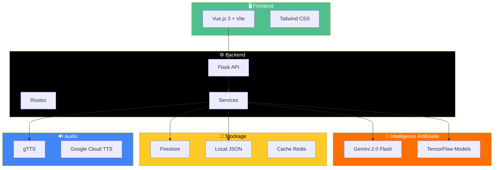
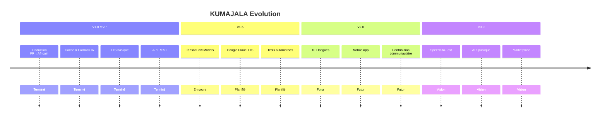

# 🌍 KUMAJALA
### La parole qui voyage. La culture qui vit.

[](https://python.org)
[](https://vuejs.org)
[](https://flask.palletsprojects.com)
[](https://tensorflow.org)
[](https://docker.com)

[](LICENSE)
[]()
[](https://firebase.google.com)

<br/>

**Application de traduction français → langues africaines avec IA et synthèse vocale**

[🚀 Demo Live](https://kumajala.vercel.app) · [📖 Documentation](#-documentation-api) · [🐛 Signaler un bug](https://github.com/Frejuste-dev/KUMAJALA-AI/issues)

</div>

---

## 📋 Table des matières

<details>
<summary>Cliquez pour développer</summary>

- [🎯 À propos](#-à-propos)
- [✨ Fonctionnalités](#-fonctionnalités)
- [🌐 Langues Supportées](#-langues-supportées)
- [🏗️ Architecture](#️-architecture)
- [🚀 Démarrage Rapide](#-démarrage-rapide)
- [🐳 Docker](#-docker)
- [📖 Documentation API](#-documentation-api)
- [🗃️ Structure du Projet](#️-structure-du-projet)
- [🛣️ Roadmap](#️-roadmap)
- [🤝 Contribution](#-contribution)
- [📜 Licence](#-licence)
- [👥 Équipe](#-équipe)

</details>

---

## 🎯 À propos

> *« Une langue qui disparaît, c'est une bibliothèque qui brûle. »*  
> — **Amadou Hampâté Bâ**

**KUMAJALA** est une plateforme innovante de **préservation des langues africaines** à travers la technologie. Développée lors du **AbiHack Hackathon**, elle combine l'intelligence artificielle et le cloud computing pour rendre accessibles les traductions entre le français et les langues locales africaines.

<div align="center">

| 🎙️ | 🤖 | ☁️ | 🔊 |
|:---:|:---:|:---:|:---:|
| **Traduction** | **Intelligence Artificielle** | **Cloud Native** | **Synthèse Vocale** |
| Français vers<br/>langues africaines | Gemini AI +<br/>TensorFlow | Firebase &<br/>Cloud Run | Écouter les<br/>traductions |

</div>

---

## ✨ Fonctionnalités

<table>
<tr>
<td width="50%">

### 🎯 Core Features

- ✅ **Traduction Intelligente**
  - Français → Bété, Baoulé, Mooré, Agni
  - Cache haute performance
  - Fallback IA avec Gemini

- ✅ **Synthèse Vocale**
  - Text-to-Speech intégré
  - Cache audio optimisé

- ✅ **API REST Complète**
  - Traduction simple & batch
  - Gestion des traductions
  - Recherche avancée

</td>
<td width="50%">

### 🚀 Features Avancées

- ✅ **Machine Learning**
  - Modèles TensorFlow personnalisés
  - Entraînement continu
  - Évaluation BLEU score

- ✅ **Infrastructure Robuste**
  - Retry automatique (backoff)
  - Validation intelligente
  - Monitoring & logs

- ✅ **Déploiement Flexible**
  - Docker & Docker Compose
  - Firebase Hosting
  - Vercel (Frontend)

</td>
</tr>
</table>

---

## 🌐 Langues Supportées

<div align="center">

| Drapeau | Langue | Code | Région | Statut |
|:-------:|:------:|:----:|:------:|:------:|
| 🇨🇮 | **Bété** | `bété` | Côte d'Ivoire | ✅ Active |
| 🇨🇮 | **Baoulé** | `baoulé` | Côte d'Ivoire | ✅ Active |
| 🇧🇫 | **Mooré** | `mooré` | Burkina Faso | ✅ Active |
| 🇨🇮 | **Agni** | `agni` | Côte d'Ivoire | ✅ Active |
| 🌍 | **Français** | `fr` | Source | ✅ Active |

</div>

> 💡 **Extensible** : L'architecture permet d'ajouter facilement de nouvelles langues

---

## 🏗️ Architecture



### 🛠️ Stack Technique

<div align="center">

| Layer | Technologies |
|:-----:|:-------------|
| **Frontend** |     |
| **Backend** |    |
| **AI/ML** |   |
| **Database** |   |
| **DevOps** |    |

</div>

---

## 🚀 Démarrage Rapide

### 📋 Prérequis

```bash
# Vérifier les versions
python --version  # 3.9+
node --version    # 18+
docker --version  # (optionnel)
```

### ⚡ Installation en 3 étapes

<details>
<summary><b>1️⃣ Cloner le projet</b></summary>

```bash
git clone https://github.com/Frejuste-dev/KUMAJALA-AI.git
cd KUMAJALA-AI
```

</details>

<details>
<summary><b>2️⃣ Configurer le Backend</b></summary>

```bash
cd backend
python -m venv venv

# Windows
venv\Scripts\activate

# Linux/Mac
source venv/bin/activate

pip install -r requirements.txt
```

Créer `.env` :
```env
GEMINI_API_KEY=votre_clé_api
FLASK_ENV=development
SECRET_KEY=votre_secret
```

Lancer :
```bash
python app.py
# ✅ API disponible sur http://localhost:5000
```

</details>

<details>
<summary><b>3️⃣ Configurer le Frontend</b></summary>

```bash
cd frontend
npm install
npm run dev
# ✅ App disponible sur http://localhost:5173
```

</details>

---

## 🐳 Docker

### Démarrage rapide avec Docker Compose

```bash
# Lancer tous les services
docker-compose up -d

# Vérifier le statut
docker-compose ps

# Voir les logs
docker-compose logs -f backend
```

### Services exposés

| Service | Port | URL |
|---------|------|-----|
| Backend API | 5000 | http://localhost:5000 |
| Frontend | 5173 | http://localhost:5173 |

---

## 📖 Documentation API

### 🔗 Base URL

```
http://localhost:5000/kumajala-api/v1
```

### 📍 Endpoints Principaux

<details>
<summary><b>🔤 Traduction</b></summary>

#### `POST /translate` - Traduire un texte

```bash
curl -X POST http://localhost:5000/kumajala-api/v1/translate \
  -H "Content-Type: application/json" \
  -d '{"text": "Bonjour", "targetLanguage": "baoulé"}'
```

**Réponse :**
```json
{
  "success": true,
  "translation": "Mo ho",
  "text": "Bonjour",
  "targetLanguage": "baoulé",
  "source": "cache",
  "processingTime": "12.5ms"
}
```

#### `POST /translate/batch` - Traduction multiple

```json
{
  "texts": ["bonjour", "merci", "au revoir"],
  "targetLanguage": "mooré",
  "continueOnError": true
}
```

</details>

<details>
<summary><b>🔊 Synthèse Vocale</b></summary>

#### `POST /speak` - Générer l'audio

```json
{
  "text": "Mo ho",
  "languageCode": "baoulé",
  "useCache": true
}
```

**Réponse :**
```json
{
  "success": true,
  "audioBase64": "//uQxAAA...",
  "contentType": "audio/mpeg",
  "cached": false
}
```

</details>

<details>
<summary><b>🌐 Langues</b></summary>

#### `GET /languages` - Liste des langues

```json
{
  "success": true,
  "languages": [
    {
      "code": "baoulé",
      "name": "Baoulé",
      "region": "Côte d'Ivoire"
    }
  ],
  "totalLanguages": 5
}
```

</details>

---

## 🗃️ Structure du Projet

```
KUMAJALA-AI/
├── 📁 backend/                    # API Flask
│   ├── 📄 app.py                  # Point d'entrée
│   ├── 📁 routes/                 # Endpoints API
│   │   ├── translate.py           # Traduction
│   │   ├── speak.py               # Text-to-Speech
│   │   ├── languages.py           # Gestion langues
│   │   └── contact.py             # Contact
│   ├── 📁 services/               # Logique métier
│   │   ├── firestore.py           # Base de données
│   │   ├── gemini.py              # IA Gemini
│   │   ├── tensorflow.py          # Modèles ML
│   │   └── tts.py                 # Synthèse vocale
│   ├── 📁 ml/                     # Machine Learning
│   │   ├── models/                # Modèles entraînés
│   │   ├── training/              # Scripts d'entraînement
│   │   └── evaluation/            # Métriques
│   └── 📁 data/                   # Données locales
│       └── language.json          # Dictionnaire
│
├── 📁 frontend/                   # Application Vue.js
│   ├── 📁 src/
│   │   ├── 📁 components/         # Composants réutilisables
│   │   ├── 📁 views/              # Pages
│   │   ├── 📁 api/                # Services HTTP
│   │   └── 📄 App.vue             # Composant racine
│   └── 📄 package.json
│
├── 🐳 docker-compose.yml          # Orchestration Docker
├── 📄 firebase.json               # Config Firebase
└── 📖 README.md                   # Ce fichier
```

---

## 🛣️ Roadmap

<div align="center">



</div>

### 📊 Progression

| Phase | Fonctionnalité | Statut |
|:-----:|:---------------|:------:|
| 1.0 | Traduction de base | ✅ |
| 1.0 | Cache intelligent | ✅ |
| 1.0 | Synthèse vocale | ✅ |
| 1.5 | Modèles TensorFlow | 🔄 |
| 1.5 | Documentation Swagger | ⏳ |
| 2.0 | Application mobile | ⏳ |
| 2.0 | 10+ langues | ⏳ |

---

## 🤝 Contribution

Les contributions sont les bienvenues ! 🎉

```bash
# 1. Fork le projet
# 2. Créer une branche
git checkout -b feature/nouvelle-fonctionnalite

# 3. Commit
git commit -m "✨ feat: Ajout d'une super fonctionnalité"

# 4. Push
git push origin feature/nouvelle-fonctionnalite

# 5. Ouvrir une Pull Request
```

### 📏 Guidelines

- 🐍 **Python** : Suivre PEP 8
- 💚 **Vue.js** : Composition API
- 📝 **Commits** : Convention [Conventional Commits](https://www.conventionalcommits.org/)
- ✅ **Tests** : Ajouter des tests pour les nouvelles fonctionnalités

---

## 📜 Licence

Ce projet est sous licence **MIT** - voir le fichier [LICENSE](LICENSE) pour plus de détails.

```
MIT License © 2025 Équipe KUMAJALA - AbiHack
```

---

## 👥 Équipe

<div align="center">

| Rôle | Responsabilité |
|:----:|:---------------|
| 🎯 **Team Leader** | Architecture & Coordination |
| ⚙️ **Backend Lead** | API Flask, Services |
| 🤖 **AI/ML Engineer** | Gemini, TensorFlow |
| 🎨 **Frontend Lead** | Vue.js, UX/UI |
| 🚀 **DevOps** | Docker, CI/CD |

</div>

---

<div align="center">

### 💌 Contact

[](mailto:contact@kumajala.org)
[](https://github.com/Frejuste-dev/KUMAJALA-AI/issues)

---

<br/>

**Fait avec ❤️ pour l'Afrique et ses langues**

*« KUMAJALA — Donner une voix numérique à nos langues, pour qu'elles continuent à voyager et à vivre. »*

<br/>


**#AbiHack #TechForGood #PreserveOurLanguages**